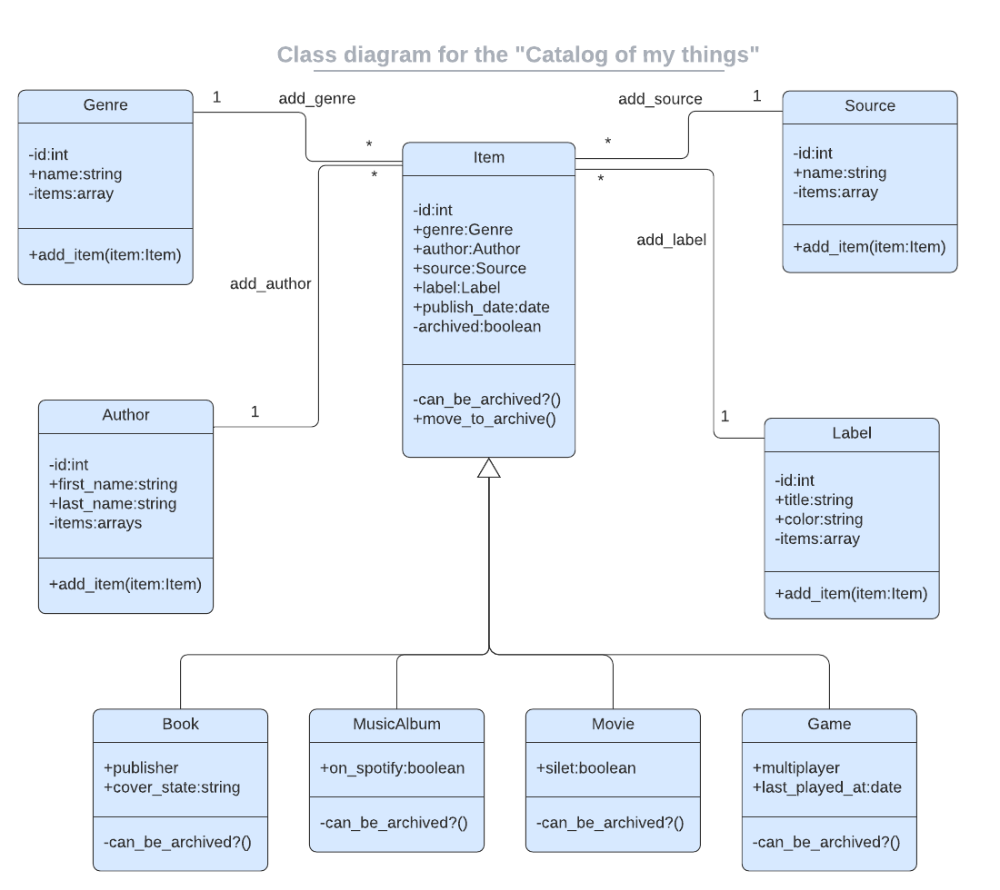

<a name="readme-top"></a>
<div align="center">
  <!-- You are encouraged to replace this logo with your own! Otherwise you can also remove it. -->
  
  <br/>

  <h3><b>UNIBEK SCHOOL LIBRARY APP</b></h3>

</div>

<!-- TABLE OF CONTENTS -->

# 📗 Table of Contents

- [📗 Table of Contents](#-table-of-contents)
- [📖 Code Morse ](#-code-morse-)
  - [🛠 Built With ](#-built-with-)
    - [Tech Stack ](#tech-stack-)
    - [Key Features ](#key-features-)
  - [💻 Getting Started ](#-getting-started-)
    - [Prerequisites](#prerequisites)
    - [Setup](#setup)
    - [Install](#install)
    - [Usage](#usage)
  - [👥 Authors ](#-authors-)
  - [🔭 Future Features ](#-future-features-)
  - [🤝 Contributing ](#-contributing-)
  - [⭐️ Show your support ](#️-show-your-support-)
  - [🙏 Acknowledgments ](#-acknowledgments-)
  - [📝 License ](#-license-)

<!-- PROJECT DESCRIPTION -->

# 📖 Code Morse <a name="about-project"></a>


**MOVIE INVENTORY** is a t a simple console app that allows users to manage collections of the movies they own.
This project is based on the following UML class diagram.

. 

## 🛠 Built With <a name="built-with"></a>

### Tech Stack <a name="tech-stack"></a>


<details>
  <summary>Ruby</summary>
  <ul>
    <li><a href="https://www.ruby-lang.org/en/">Ruby</a></li>
  </ul>
</details>


<!-- Features -->

### Key Features <a name="key-features"></a>

- **Add Movie option**
- **Add Movie Source**
- **List added movies**
- **List avalable sources**
- **Preserve data**

<p align="right">(<a href="#readme-top">back to top</a>)</p>


<!-- GETTING STARTED -->

## 💻 Getting Started <a name="getting-started"></a>


To get a local copy up and running, follow these steps.

### Prerequisites

In order to run this project you need:


- Code editor like VS code
- Ruby installed in your machine


### Setup

Clone this repository to your desired folder:


```sh
  cd my-folder
  git clone https://github.com/geekelo/ruby-movie_inventory_project.git
```


### Install

Install this project with:


```sh
  cd ruby-movie_inventory_project
  bundle install
```


### Usage

To run the project, execute the following command:


```sh
  ruby main.rb
```


<p align="right">(<a href="#readme-top">back to top</a>)</p>

<!-- AUTHORS -->

## 👥 Authors <a name="authors"></a>


👤 **Eloghene Otiede**

- GitHub: [@githubhandle](https://github.com/geekelo)
- Twitter: [@twitterhandle](https://twitter.com/geekelo_xyz)
- LinkedIn: [LinkedIn](https://linkedin.com/in/eloghene-otiede)


<p align="right">(<a href="#readme-top">back to top</a>)</p>

<!-- FUTURE FEATURES -->

## 🔭 Future Features <a name="future-features"></a>


- [ ]  **Add Delete option **


<p align="right">(<a href="#readme-top">back to top</a>)</p>

<!-- CONTRIBUTING -->

## 🤝 Contributing <a name="contributing"></a>

Contributions, issues, and feature requests are welcome!

Feel free to check the [issues page](https://github.com/geekelo/unibek-school_library_app/issues).

<p align="right">(<a href="#readme-top">back to top</a>)</p>

<!-- SUPPORT -->

## ⭐️ Show your support <a name="support"></a>


If you like this project drop a ⭐️

<p align="right">(<a href="#readme-top">back to top</a>)</p>

<!-- ACKNOWLEDGEMENTS -->

## 🙏 Acknowledgments <a name="acknowledgements"></a>


I would like to thank from Microverse for adding the guidlines of project.

<p align="right">(<a href="#readme-top">back to top</a>)</p>>


<!-- LICENSE -->

## 📝 License <a name="license"></a>

This project is [MIT](./MIT.md) licensed.


<p align="right">(<a href="#readme-top">back to top</a>)</p>